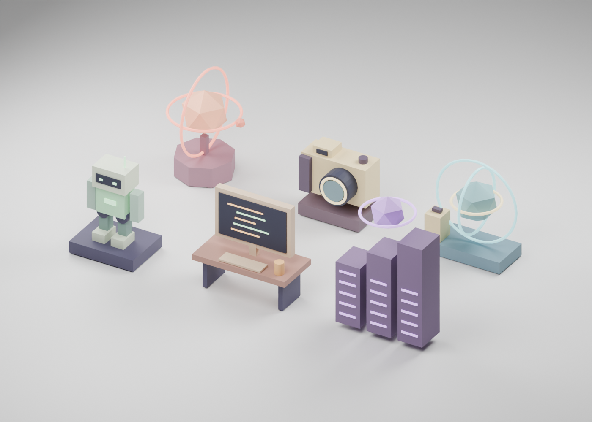

# Blender district kit

## Personalized travel companions

`sam-travel-couple.png` is a Blender-rendered seaside vignette inspired by the supplied couple photo: dark swept hair and charcoal shirt, tied-up hair and lilac shirt, a shoulder embrace, and a travel camera. These are stylized characters; unseen clothing and the miniature setting are artistic additions. The source photograph is not bundled or used as a texture.

- `sam-travel-couple.blend`: editable individual character parts and seaside scene.
- `sam-travel-couple.glb`: static, texture-free portrait pair with refined cheek, jaw, chin, eyelid and smile geometry.
- `sam-animated-companions.blend`: separate rigid-part joints for both travellers. `sam-avatar.glb` and `companion-avatar.glb` are independently exported; the hashed web copies are selected by `components/world/character-manifest.json`.
- The website now uses these avatars for the player and following companion. R3F animates the head, arms and legs for walking, waving, jumping and celebrating. These are runtime joint animations, not skinned animation clips embedded in the GLBs.
- Run Blender with `--python scripts/blender/build_characters.py`, then `bun scripts/blender/validate_characters.mjs` to rebuild and validate the playable avatars. The validator re-imports both through Three.js and checks joint names, dimensions, raised-arm direction and asset budgets. Measured results are in `character-report.json` (554,732 bytes / 8,728 triangles combined).
- `sam-exe-personal-world.png` / `.blend`: full island artwork including the couple at the front promenade and the four city portals.

Rebuild with Blender background mode and `--python-exit-code 1 --python scripts/blender/render_couple.py`, then `scripts/blender/render_personal_world.py`. These scripts replace their generated outputs; save manual edits under a separate name.

Status: all six GLBs generated with Blender 5.2.1 LTS, validated, and visually inspected in a rendered re-import preview. Website TypeScript and production build pass.



## Generate after installing Blender

```sh
bun run models:check
bun run models:build
bun run models:validate
bun run check
bun run build
```

The launcher locates `/Applications/Blender.app/Contents/MacOS/Blender` or `blender` on PATH. Set `BLENDER_BIN` to an executable path for a custom installation. No MCP server or add-on is required for this background script workflow.

`models:build` opens a fresh Blender process with factory startup, creates six original static low-poly installations, exports content-addressed GLBs, saves an editable kit, and updates `components/world/model-manifest.json` only after all exports succeed. It never opens a user's existing Blender scene. Re-running replaces `sam-exe-kit.generated.blend`; save artistic edits under a different filename before rebuilding. Previous hashed GLBs are retained so a failed generation cannot break the active catalog.

## Art direction

| District    | Main object                      | Supporting details              | Accent     |
| ----------- | -------------------------------- | ------------------------------- | ---------- |
| Robotics    | Friendly humanoid on a workbench | Visor, chest light, antenna     | Mint       |
| Frontend    | Physical desktop workspace       | Code lines, keyboard, coffee    | Apricot    |
| Blockchain  | Three server towers              | Faceted core, orbit             | Lilac      |
| AI          | Small observatory sculpture      | Two orbital rings, satellite    | Coral      |
| Photography | Oversized analog camera          | Lens, viewfinder, shutter, grip | Warm ivory |
| Travel      | Globe portal                     | Meridian, equator, suitcase     | Sea glass  |

All helpers use the site's Y-up coordinates and convert to Blender Z-up. The GLB exporter converts them back to Y-up. Each installation is centered at the origin, with its base on the ground; the website owns world placement, district labels, the player, and lighting. The first kit is static; robot rigging and animated clips are a separate art pass.

## Outputs

- `public/models/<district>-<hash>.glb`: web asset, no external textures or decoder downloads.
- `assets/blender/sam-exe-kit.generated.blend`: editable objects grouped by district; photography is initially visible, other collections hidden to avoid overlap at the origin.
- `assets/blender/report.json`: measured triangles, file bytes, and object counts.
- `components/world/model-manifest.json`: activates successfully exported assets.

## Budgets and validation

Each district must stay below 12,000 triangles and 500,000 bytes. These are ceilings, not measured results or a frame-rate guarantee. The generated report gives actual counts. The validator checks GLB headers, the six catalog entries, embedded geometry, triangle budgets, and absence of texture or decoder dependencies. The generated kit totals 299,468 bytes (292.4 KiB) and 3,868 triangles across 72 primitives. Re-imported models have been visually inspected for orientation, materials, and silhouette. Real-device loading time and frame rate remain unmeasured.

The R3F loader shows the existing procedural installation during loading and on errors. There is no global preload. Mobile still imports the 3D world only after the visitor enters it.

References: [Blender export operators](https://docs.blender.org/api/main/bpy.ops.export_scene.html), [Drei useGLTF](https://drei.docs.pmnd.rs/loaders/gltf-use-gltf).
